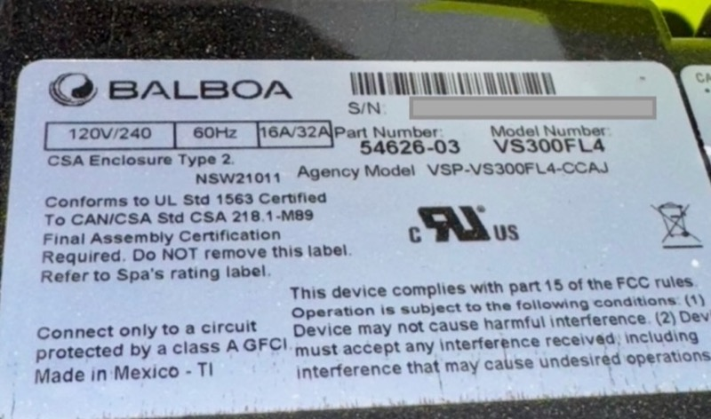
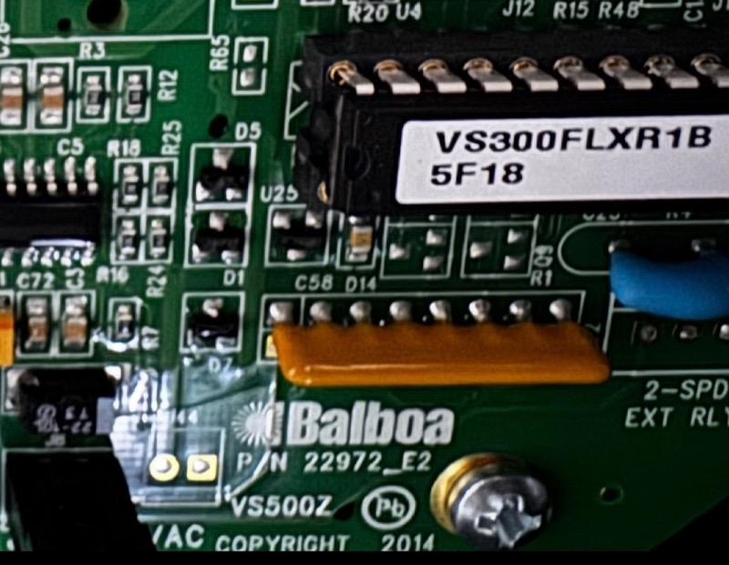
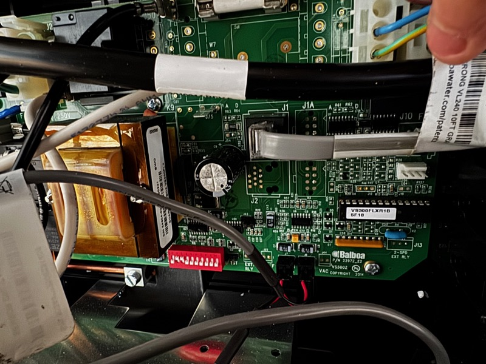
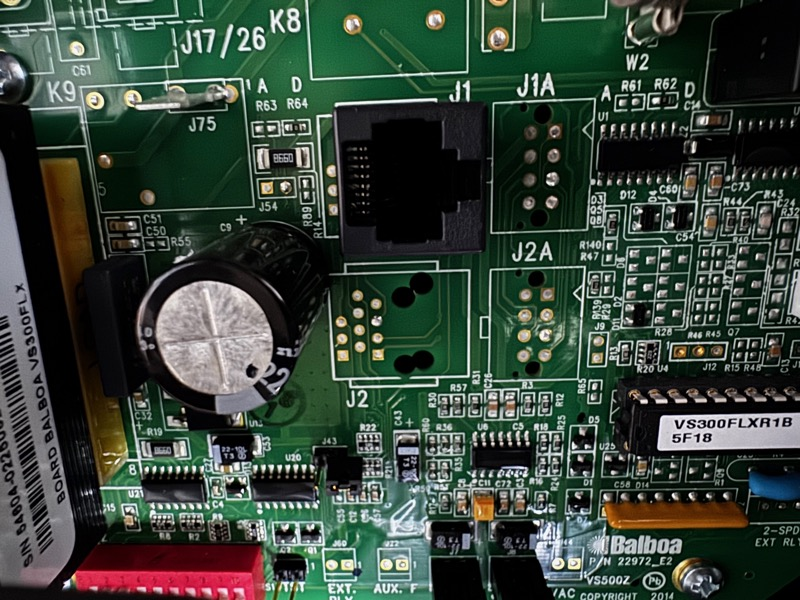
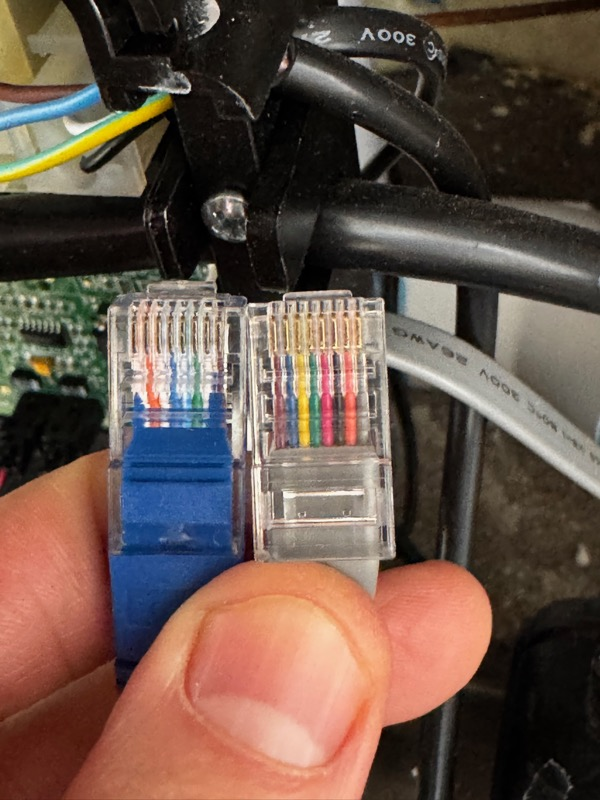

# Tublemetry

ESPHome-based hot tub automation for Balboa VS300FL4 controllers. Reads the topside panel display via synchronous clock+data protocol and exposes water temperature as a Home Assistant climate entity.

This is the first published automation for the Balboa VS-series board family. The VS300FL4 (PCB: VS500Z) uses a synchronous clock+data protocol that is completely different from the BWA Wi-Fi protocol used by newer BP-series boards.


## Spa

Developed on an [Evolution by Strong Spas Rockport](https://www.costco.com/p/-/evolution-by-strong-spas-rockport-27-jet-6-or-7-person-rotomolded-spa-plug-n-play/100390145) (Costco Item 1003651).

| Spec | Value |
|------|-------|
| Model | Evolution by Strong Spas Rockport 27-Jet |
| Seating | Lounger for up to 6, or non-lounger for up to 7 |
| Jets | 27 stainless steel |
| Water capacity | 300 US gallons |
| Dimensions | 74.5" L x 74.5" W x 32" H (outside cabinet) |
| Shell | 66" x 66" x 30" (inside), rugged resin (rotomolded) |
| Weight | 425 lbs dry, 2,933 lbs filled |
| Pump | 1x 2BHP (1.5CHP) 2-speed |
| Heater | 1kW / 4kW stainless steel all-season |
| Electrical | 120V plug-n-play (GFCI cord included), convertible to 240V |
| Sanitation | Ozone |
| Controller | Balboa VS300FL4 (PCB: VS500Z, P/N 22972_E2) |
| Topside panel | Balboa VL-series (VL401/VL403/VL406U) -- digital backlit, analog buttons, no microcontroller |
| Features | Built-in ice bucket with lid, dual water columns, programmable LED underwater lighting, headrests |
| Cover | Heavy-duty 4" to 2" tapered vinyl soft cover (R-13.8), locking clips, lifting handles |
| Steps | Included |

This controller is common in rotomolded spas from Strong Spas, Lifesmart, AquaRest, and other brands sold at Costco, Sam's Club, and Home Depot. If your tub has a VL-series topside panel with a 3-digit 7-segment display and an RJ45 connector at J1, this project likely applies.

### Identifying Your Board


*Balboa VS300FL4 rating label -- 120V/240V, 16A/32A, P/N 54626-03*


*Strong Industries model plate -- Model S6-0001*


*PCB label: VS300FLXR1B, Balboa P/N 22972_E2, VS500Z*

### Board and Connectors


*VS500Z board with J1 RJ45 connector (topside panel cable plugged in)*


*J1 RJ45 jack -- this is where you tap the clock and data signals*


*Left: T568B stub cable (standard colors). Right: OEM panel cable (non-standard colors). Always go by pin number, not wire color, when working with the OEM cable.*

## Hardware

- **ESP32**: WROOM-32 (any dev board)
- **Connection**: RJ45 T-splitter at J1, tapping 3 wires (clock, data, ground)
- **Level shifting**: Voltage divider required (5V signals to 3.3V ESP32 GPIO)

## Protocol

The VS300FL4 does **not** use RS-485, BWA framing, or any documented Balboa protocol. The topside panel connector carries a synchronous clock+data signal:

| RJ45 Pin | T568B Color | Signal |
|----------|-------------|--------|
| 1 | Orange/White | +5V |
| 4 | Blue | GND |
| 5 | Blue/White | Data (display segments, sampled on clock rising edge) |
| 6 | Green | Clock (24 pulses per frame at 60Hz) |
| 2,3,7,8 | Various | Analog button lines |

### Frame Structure (24 bits)

```
[7 bits: digit 1] [7 bits: digit 2] [7 bits: digit 3] [3 bits: status]
```

- 3 x 7-bit display digits + 3 status bits = 24 bits per frame
- Frames repeat at 60Hz (16.7ms period)
- Frame boundary: gap > 500us between clock pulses
- Data sampled on clock rising edge (MSB-first within each digit)

### 7-Segment Encoding

Confirmed via logic analyzer ladder capture (temperatures 86-105F + mode displays):

| Value | Character | Segments | Notes |
|-------|-----------|----------|-------|
| 0x7E | 0 | a,b,c,d,e,f | |
| 0x30 | 1 | b,c | |
| 0x6D | 2 | a,b,d,e,g | |
| 0x79 | 3 | a,b,c,d,g | |
| 0x33 | 4 | b,c,f,g | |
| 0x5B | 5/S | a,c,d,f,g | Same glyph |
| 0x5F | 6 | a,c,d,e,f,g | |
| 0x70 | 7 | a,b,c | |
| 0x7F | 8 | a,b,c,d,e,f,g | |
| 0x73 | 9 | a,b,c,f,g | **Differs from GS510SZ (0x7B)** -- no bottom segment |
| 0x00 | (blank) | none | |
| 0x37 | H | b,c,e,f,g | OH error display |
| 0x4F | E | a,d,e,f,g | Ec (economy mode) |
| 0x0D | c | d,e,g | Ec (economy mode) |
| 0x0E | L | d,e,f | SL (sleep mode) |
| 0x0F | t | d,e,f,g | St (standby mode) |

Segment mapping: `bit6=a, bit5=b, bit4=c, bit3=d, bit2=e, bit1=f, bit0=g`

## Wiring

```
                          RJ45 T-splitter at J1
                         /                      \
              Topside panel cable            Stub cable (T568B, cut end)
              (undisturbed)                       |
                                            3 bare wires
                                                  |
                                        Voltage divider (5V->3.3V)
                                                  |
                                        ESP32 GPIO pins
                                          Clock -> GPIO16
                                          Data  -> GPIO17
                                          GND   -> GND
```

The stub cable is a standard T568B patch cable with one end cut, exposing Blue (Pin 4 / GND), Blue/White (Pin 5 / Data), and Green (Pin 6 / Clock).

A resistor voltage divider is required on the Clock and Data lines to shift from 5V to 3.3V for ESP32 GPIO input.

## Installation

### ESPHome

1. Copy the `esphome/` directory to your ESPHome config folder
2. Edit `tublemetry.yaml`:
   - Set your WiFi credentials (or use `secrets.yaml`)
   - Adjust `clock_pin` and `data_pin` GPIO numbers for your wiring
3. Compile and flash:
   ```bash
   esphome compile esphome/tublemetry.yaml
   esphome upload esphome/tublemetry.yaml
   ```
4. The device will appear in Home Assistant with:
   - **Climate entity**: "Hot Tub" -- shows current water temperature
   - **Text sensors**: display string, raw hex, display state, digit values (diagnostic)
   - **Sensor**: decode confidence percentage (diagnostic)

### Python Tools (for protocol analysis)

```bash
# Install dependencies
uv sync

# Run tests
uv run pytest tests/ -v

# Decode a logic analyzer capture (sigrok CSV export)
uv run python 485/scripts/decode_clockdata_v2.py capture.csv

# Interactive ladder capture with sigrok-cli
uv run python 485/scripts/ladder_sigrok.py
```

## Project Status

- [x] Protocol reverse-engineered (synchronous clock+data, not RS-485)
- [x] 7-segment lookup table fully confirmed (all digits 0-9, mode letters)
- [x] Python decode library with 75 tests
- [x] ESPHome component (GPIO interrupt-driven)
- [ ] Hardware validation (ESP32 reading live display)
- [ ] Button injection for setpoint control (Phase 2)
- [ ] TOU automation in Home Assistant (Phase 2)

## Related Projects

- [MagnusPer/Balboa-GS510SZ](https://github.com/MagnusPer/Balboa-GS510SZ) -- Same protocol family (GS-series boards). Primary reference for interrupt-driven reading approach.
- [Shuraxxx/Balboa-GS523DZ](https://github.com/Shuraxxx/-Balboa-GS523DZ-with-panel-VL801D-DeluxeSerie--MQTT) -- Similar VL panel, similar approach.
- [netmindz/balboa_GL_ML_spa_control](https://github.com/netmindz/balboa_GL_ML_spa_control) -- **Different protocol** (GL/ML boards with smart panels use RS-485). Does NOT apply to VS-series.
- [ccutrer/balboa_worldwide_app](https://github.com/ccutrer/balboa_worldwide_app) -- BWA Wi-Fi protocol for BP-series boards. Does NOT apply to VS-series.

## Key Differences from GS510SZ

| | VS300FL4 | GS510SZ |
|---|----------|---------|
| Bits per frame | 24 | 39 |
| Display digits | 3 | 4+ |
| "9" encoding | 0x73 (no bottom segment) | 0x7B (with bottom segment) |
| Panel | VL401/403 | VL801D |
| Board generation | VS-series | GS-series |

## License

MIT
